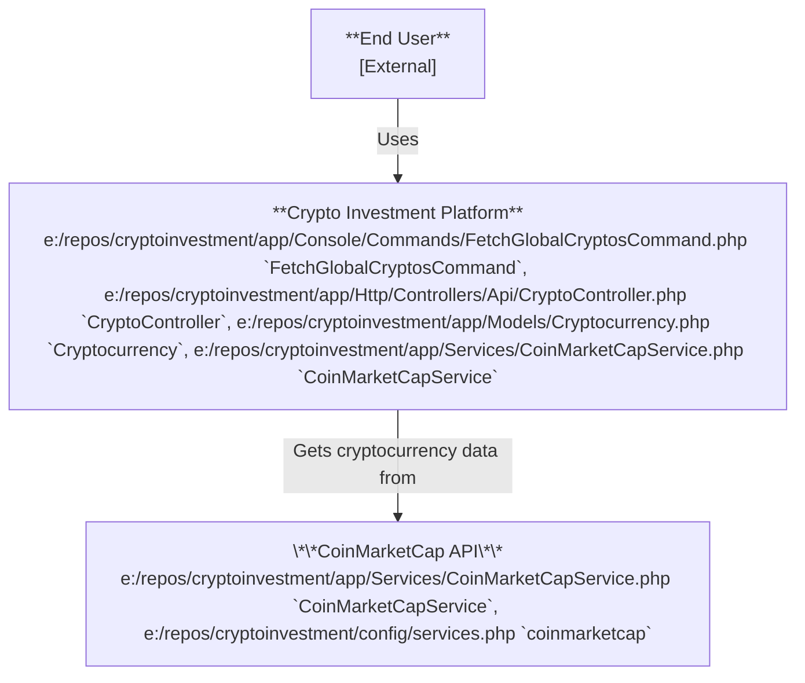

# Unnamed CodeViz Diagram

```mermaid
graph TD

    base.cv::cryptoinvestment["**Crypto Investment Platform**<br>e:/repos/cryptoinvestment/app/Console/Commands/FetchGlobalCryptosCommand.php `FetchGlobalCryptosCommand`, e:/repos/cryptoinvestment/app/Http/Controllers/Api/CryptoController.php `CryptoController`, e:/repos/cryptoinvestment/app/Models/Cryptocurrency.php `Cryptocurrency`, e:/repos/cryptoinvestment/app/Services/CoinMarketCapService.php `CoinMarketCapService`"]
    base.cv::user["**End User**<br>[External]"]
    base.cv::coinmarketcap["\*\*CoinMarketCap API\*\*<br>e:/repos/cryptoinvestment/app/Services/CoinMarketCapService.php `CoinMarketCapService`, e:/repos/cryptoinvestment/config/services.php `coinmarketcap`"]
    %% Edges at this level (grouped by source)
    base.cv::user["**End User**<br>[External]"] -->|"Uses"| base.cv::cryptoinvestment["**Crypto Investment Platform**<br>e:/repos/cryptoinvestment/app/Console/Commands/FetchGlobalCryptosCommand.php `FetchGlobalCryptosCommand`, e:/repos/cryptoinvestment/app/Http/Controllers/Api/CryptoController.php `CryptoController`, e:/repos/cryptoinvestment/app/Models/Cryptocurrency.php `Cryptocurrency`, e:/repos/cryptoinvestment/app/Services/CoinMarketCapService.php `CoinMarketCapService`"]
    base.cv::cryptoinvestment["**Crypto Investment Platform**<br>e:/repos/cryptoinvestment/app/Console/Commands/FetchGlobalCryptosCommand.php `FetchGlobalCryptosCommand`, e:/repos/cryptoinvestment/app/Http/Controllers/Api/CryptoController.php `CryptoController`, e:/repos/cryptoinvestment/app/Models/Cryptocurrency.php `Cryptocurrency`, e:/repos/cryptoinvestment/app/Services/CoinMarketCapService.php `CoinMarketCapService`"] -->|"Gets cryptocurrency data from"| base.cv::coinmarketcap["\*\*CoinMarketCap API\*\*<br>e:/repos/cryptoinvestment/app/Services/CoinMarketCapService.php `CoinMarketCapService`, e:/repos/cryptoinvestment/config/services.php `coinmarketcap`"]

```
---
*Generated by [CodeViz.ai](https://codeviz.ai) on 2/26/2026, 8:14:53 PM*
